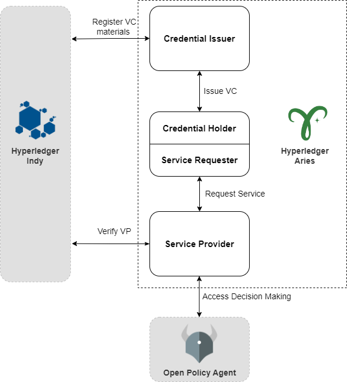

# Bachelor Thesis Zhenghao Zhang

## Overview

This directory contains a decentralized identity-based agent representing things in Forestry. The agent acts as a TCP server and receives commands in JSON form.

An extra GUI based on pyqt5 is also provided, acting as a client sending commands.

The overall architecture is shown as follows:

In order to let the agent work properly, a distributed ledger and an external access control engine is required.

The recommended test setup is :

Distributed ledger: [bcgov/von-network: A portable development level Indy Node network. (github.com)](https://github.com/bcgov/von-network)

Access Control Engine: [open-policy-agent/opa: An open source, general-purpose policy engine. (github.com)](https://github.com/open-policy-agent/opa)

However, the system does not depend on certain choices of them. You can use any implementation with the same functionality to replace any of them.

Before starting an agent, please copy all files from [hyperledger/aries-cloudagent-python: Hyperledger Aries Cloud Agent Python (ACA-Py)(github.com)](https://github.com/hyperledger/aries-cloudagent-python)  under the path `Code/Aries/aries-cloudagent-python`. (recommended)

Optionally, you can also use the Python package ` aries-cloudagent `. In this case, some minor changes have to be done in the docker files.

Note: An docker image will be published on docker hub soon.

## OPA

First, you can find a YAML file called  `docker-compose.yml` under `Code/OPA`. By using the command `docker-compose up`, you can simply start OPA running as a docker. 

You can also find some policy files in the same directory, these will be automatically used by the agent if you choose the corresponding option while starting the agent.

## Agent

To start the agent, please run the shell file under the path `\Code\Aries\aries-cloudagent-python\demo`.

An example to start an Agent with GUI will be like:

` ./run_demo gui 8000 moisture_sensor001   `

​	`gui` means a GUI will also be started.

​	`8000` is the port used by the agent.

​	`moisture_sensor001 ` is the name of the agent.

You can use `` ./run_demo gui --help` for further information.

After stating the agent, a GUI window will pop up with two options: Provision and Start

#### Provision 

Create a new wallet that can be used in later start phase.

#### Start

Start a new agent. If no provisioned wallet is given, a random wallet will be created.

Once the operation menu pops up, you can control the agent following the given instructions.

